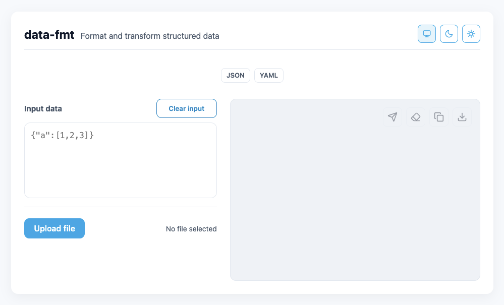

# data-fmt · Data Formatter

[](./LICENSE)
[](./)


UI for formatting and transforming structured data (**JSON, YAML**) using **jq** and `js-yaml`.  
Everything runs inside **Docker**, so you don’t need to install Node or jq on your machine.




---

## Stack

- Docker image based on `node:24-alpine` with [`jq`](https://github.com/jqlang/jq) included  
- Express backend with support for **JSON** and **YAML** (via [`js-yaml`](https://github.com/nodeca/js-yaml))  
- Static UI served from `public/`  
- Exposed port: **8080**

---

## Requirements

- Docker and Docker Compose

---

## How to run

Use the `Makefile` at the root of the project.

### Clean build
```bash
make build
```

### Start using an already built image
```bash
make up
# Open http://localhost:8080
```

### Stop
```bash
make down
```

---

## Features

- ✅ Format and transform **JSON** with jq  
- ✅ Format and transform **YAML** with js-yaml + jq  
- ✅ Copy, download, or upload data files  
- ✅ Modern, responsive UI  
- 🔒 Your data is processed inside a local container  

---

## Usage

1. Paste or upload your JSON or YAML  
2. Copy or download the output  

👉 For details about JSON/YAML support and limitations, see [docs/usage-json-yaml.md](./docs/usage-json-yaml.md).

---

## Roadmap (JSON & YAML)

- [ ] **Validation feedback**  
  Show clearer error messages when JSON/YAML is invalid (including line and column).

- [ ] **YAML ↔ JSON toggle**  
  Add a UI option to convert YAML to JSON and vice versa, not only format.

- [ ] **Preserve YAML comments**  
  Currently comments are lost during re-serialization; investigate ways to keep them.

- [ ] **Schema validation (JSON Schema / OpenAPI)**  
  Allow validating a JSON/YAML document against a defined schema.

- [ ] **jq filter examples**  
  Provide pre-defined filter snippets (e.g. `.users[] | .name`) for users unfamiliar with jq.

- [ ] **Large file handling**  
  Optimize processing of large files (streaming instead of loading everything into memory).

- [ ] **YAML anchors/aliases support**  
  Document or improve handling of anchors (`&`, `*`) and merges (`<<`).

- [ ] **Better error recovery for YAML**  
  Extend the sanitizer with more heuristics to fix tricky indentation issues.


---

## License

This project is licensed under the **GNU General Public License v3.0**.  
You are free to use, modify, and distribute it, but any distribution must remain under the same GPLv3 license.  

See the full text in [LICENSE](./LICENSE).

---
